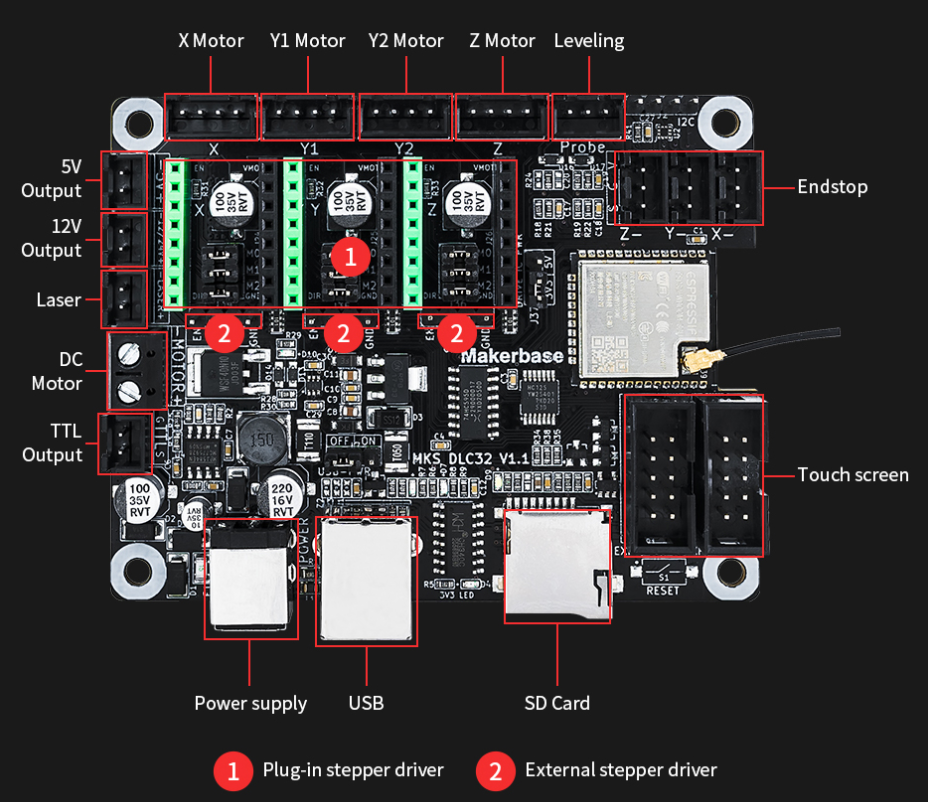

# 2.1 - ESP32 microcontroler

We have several options here:

## MakerBase DLC32 v2.1
Aliexpress: <https://www.aliexpress.com/item/1005003183498253.html?spm=a2g0o.store_pc_home.productList_8356958.pic_0> - less than $2.00

I got my hands onto one of these boards...pretty inexpensive at the time.  Key features on why it was a good choice:

- [x] ESP32 based microcontroller ✅
  - [x] 8MB flash
  - [x] 520KB RAM
  - [x] 240MHz CPU
  - [x] 2.4GHz Wi-Fi
  - [x] Real-time clock; need to set to UNIX Epoch
- [x] Three stepper motors - X axis (for my RA), Y-axxis (for my Declination), and Z-axis (for my Focuser) ✅
   - [x] 12v/24v power input
   - [ ] motors are stepped via 74HC595 shift-register; will be tricky to implement
- [x] pins on board to connect external modules, ie GPS ✅
- [ ] Board support crate in Rust 🦀
- [ ] external TFT screen - not necessary, but pins are accessible
- [ ] external SD card - not necessary, but could become useful

## Breadboarding it

Just gonna use a breadboard for now.  I'm not sure if I'll need to use a breadboard for this project, but I'm going to start with one.  I'll probably need to add some jumper wires to the board, but I'll see how it goes.  Here I can test out a few minor things before I start coding.

So, just an ESP32 DevKit.  Here, I can get some of the concepts implemented, like: 
- [x] Wifi going, for example.
- [x] Real-time clock,
- [x] a webserver, 
- [x] the GPS,
- [x] the stepper motors going

before launching onto the MKSDLC32 board directly, matching pins of course.  Trial-n-error is the best way to learn.

## Let's build our own custom board

This option means once we've settled on a board, we can start to design/build it from scratch, using something like KiCAD, and get the board made up via PCBWay or JLCPCB.  I'm going to target my use with the MKSDLC32 board.  I'll start with the ESP32-DevKitC, which is a smaller board, and then I'll add on the features I need.

Maybe the ESP32 just won't cut it...maybe I need something "stronger".  The RaspberryPI Zero 2W looks promising as the microcontroller, but i'd still have to design a board for the stepper motors.  I'm not sure yet.  I'll see how it goes.