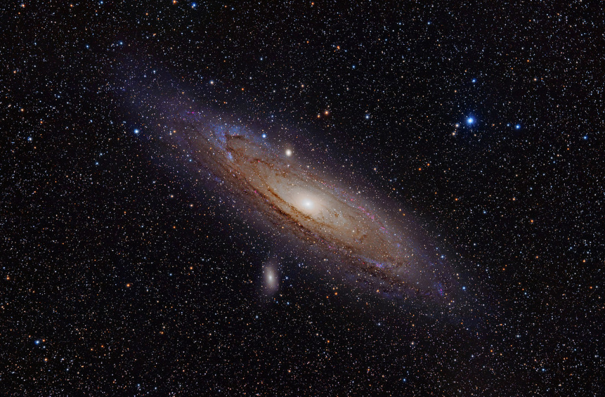

# 1.2 - Location & Time

## Coordinate systems

### Longitude and Latitude

The **latitude** (abbreviation: Lat., ϕ, or phi) of a point on Earth's surface is the angle between the equatorial plane and the straight line that passes through that point and through (or close to) the center of the Earth.[note 2] Lines joining points of the same latitude trace circles on the surface of Earth called parallels, as they are parallel to the Equator and to each other. The North Pole is 90° N; the South Pole is 90° S. The 0° parallel of latitude is designated the Equator, the fundamental plane of all geographic coordinate systems. The Equator divides the globe into **Northern** and **Southern Hemispheres**. 

The **longitude** (abbreviation: Long., λ, or lambda) of a point on Earth's surface is the angle east or west of a reference meridian to another meridian that passes through that point. All meridians are halves of great ellipses (often called great circles), which converge at the North and South Poles. The meridian of the British Royal Observatory in Greenwich, in southeast London, England, is the international prime meridian, although some organizations—such as the French Institut national de l'information géographique et forestière—continue to use other meridians for internal purposes. The prime meridian determines the proper **Eastern** and **Western Hemispheres**

### Right Ascension & Declination

**Right Ascension** (RA) is the celestial equivalent of longitude on Earth. It is the angular distance measured eastward along the celestial equator from the Sun's position at the vernal equinox (the First Point of Aries) to the hour circle passing through the celestial object in question. RA is measured in hours (h), minutes (m), and seconds (s), with 24 hours being a full circle or 360 degrees.

**Declination** (Dec) is the celestial equivalent of latitude on Earth. It is the angular distance of a celestial object north or south of the celestial equator, measured in degrees (°), minutes ('), and seconds ("). Declination ranges from +90° at the north celestial pole to -90° at the south celestial pole, with 0° being the celestial equator.

Together, **Right Ascension** and **Declination** form the equatorial coordinate system used to specify the precise location of stars, planets, and other celestial objects on the celestial sphere.

**Astronomy catalogues** use the **International Celestial Reference Frame (ICRF)** to specify the location of celestial objects. The ICRF is a coordinate system based on the **Equatorial Coordinate System (ECEF)** and the **International Terrestrial Reference System (ITRS)**. The ICRF is a **right-handed** coordinate system, with the origin at the centre of the Earth's equator at the vernal equinox (the First Point of Aries), and the axes oriented along the equator and the ecliptic plane. The ICRF is a **spherical** coordinate system, with a radius of 6378.137 km.

As an example, **Messier 31 (M31)**, better known as the Andromeda Galaxy, is a large spiral galaxy located in the constellation Andromeda. Lying at a distance of 2.54 million light years from Earth, the Andromeda Galaxy is the nearest major galaxy to our own. It is on a collision course with our home galaxy, the Milky Way. Messier 31 has an apparent magnitude of 3.44. Its designation in the New General Catalogue is NGC 224.  It's coordinates are: 

RA: 00h 42m 44s
Dec: +41° 16' 09"

These coordinates are given in the J2000 epoch. It's worth noting that there are slight variations in the precise coordinates across different sources, which is common for large extended objects like galaxies. For example:

- One source lists RA: 00h 42' 58", Dec: +41° 16' 32"
- Another gives RA: 00h 41.8m, Dec: +41° 16'

These minor differences are likely due to variations in measurement techniques or the specific part of the galaxy being referenced as the center point. However, all sources agree on the general location in the sky, placing Messier 31 in the constellation Andromeda.

So, provided we know where we are on the Earth (Latitude/Longitude), we should be able to find and point to the coordinates of any celestial object.

> That's cool!! 🆒  "Close only counts in horseshoes and hand grenades" - Anonymous

### Prime Meridian and Local Meridian

**Prime Meridian** - A prime meridian is an arbitrarily-chosen meridian (a line of longitude) in a geographic coordinate system at which longitude is defined to be 0°. Together, a prime meridian and its anti-meridian (the 180th meridian in a 360°-system) form a great circle. This great circle divides a spheroid, like Earth, into two hemispheres: the Eastern Hemisphere and the Western Hemisphere (for an east-west notational system). For Earth's prime meridian, various conventions have been used or advocated in different regions throughout history. Earth's current international standard prime meridian is the IERS Reference Meridian. It is derived, but differs slightly, from the Greenwich Meridian, the previous standard.

**Local Meridian** - A local meridian is a meridian that is used to specify the longitude of a celestial object. For example, the local meridian of the Greenwich observatory is the Greenwich meridian, which is the international standard meridian for the United Kingdom.  Based on your location, the local meridian can be different from the international standard meridian, and is often referred to as the observatory meridian.

## Time Systems

### Fundamental Concepts

**Time** is a measure of the duration between events. In scientific contexts, it's typically measured in seconds (s), though larger units like minutes (m), hours (h), days (d), weeks (w), and years (y) are also used.

**Julian Date (JD)** is a continuous count of days and fractions thereof from the beginning of the Julian Period, starting at noon Universal Time on January 1, 4713 BCE (on the Julian calendar). It's widely used in astronomy for its simplicity in calculating time intervals.

**Gregorian Calendar** is the internationally accepted civil calendar. It was introduced by Pope Gregory XIII in 1582 as a reform of the Julian calendar. It has 12 months of varying lengths, with a leap year every four years (with some exceptions).

**J2000.0** refers to the standard epoch used in astronomy, corresponding to 12:00 Terrestrial Time (TT) on January 1, 2000 in the Gregorian calendar. This equates to JD 2451545.0 (TT).

### Time Scales

**Universal Time (UT)** is a time scale based on the Earth's rotation. There are several versions: UT0, UT1, and UT2, with UT1 being the principal form directly obtained from observations.

**Coordinated Universal Time (UTC)** is the primary time standard by which the world regulates clocks and time. It's based on International Atomic Time (TAI) with leap seconds added to keep it close to UT1.

**International Atomic Time (TAI)** is a highly precise atomic coordinate time standard based on the SI second. It's the basis for other time scales.

**Terrestrial Time (TT)** is a theoretical ideal time scale for observations from the surface of the Earth. It's essentially TAI + 32.184 seconds.

**Barycentric Dynamical Time (TDB)** is a relativistic time scale intended for astronomical use, particularly for solar system ephemerides.

**GPS Time** is the time scale used by the Global Positioning System. It's ahead of TAI by 19 seconds and does not include leap seconds.

> 📡 We'll be using a GPS to establish the time reference for our mount.

### Astronomical Time Concepts

**Sidereal Time** is time measured by the apparent diurnal motion of the vernal equinox. A sidereal day is slightly shorter than a solar day.

**Local Sidereal Time (LST)** is sidereal time for a specific longitude on Earth. It's crucial for determining which celestial objects are observable at a given location and time.  Here's an online calculator [Sidereal Time](http://neoprogrammics.com/sidereal_time_calculator/index.php)

**Vernal Equinox** is one of two points where the celestial equator intersects the ecliptic. It's used as a reference point in several coordinate systems.

### Specialized Time Systems

**Unix Time** (or POSIX time) is a system for describing instants in time, defined as the number of seconds that have elapsed since 00:00:00 UTC on 1 January 1970 (the Unix Epoch), not counting leap seconds.

**Epoch** in computing and astronomy often refers to a specific point in time used as a reference for time-dependent calculations.

**Topocentric Time** isn't a standard term, but in astronomy, "topocentric" refers to a coordinate system centered on a specific location on Earth's surface, as opposed to geocentric (Earth-centered) or heliocentric (Sun-centered) systems.

