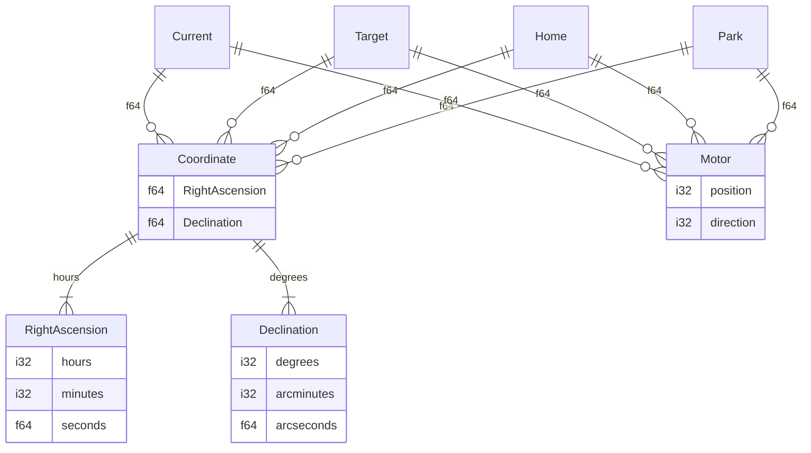

# Chapter 1

Data baby!!  DATA...

```mermaid
erDiagram
Coordinate ||--|{ RightAscension : hours
Coordinate ||--|{ Declination : degrees
Current only one to zero or more Coordinate : f64
Target only one to zero or more Coordinate : f64
Home only one to zero or more Coordinate : f64
Park only one to zero or more Coordinate : f64
Current only one to zero or more Motor : f64
Target only one to zero or more Motor : f64
Home only one to zero or more Motor : f64
Park only one to zero or more Motor : f64

Coordinate {
    f64 RightAscension
    f64 Declination
}
RightAscension {
    i32 hours
    i32 minutes
    f64 seconds
    }
Declination {
    i32 degrees
    i32 arcminutes
    f64 arcseconds
    }
Motor {
    i32 position
    i32 direction
    }
```